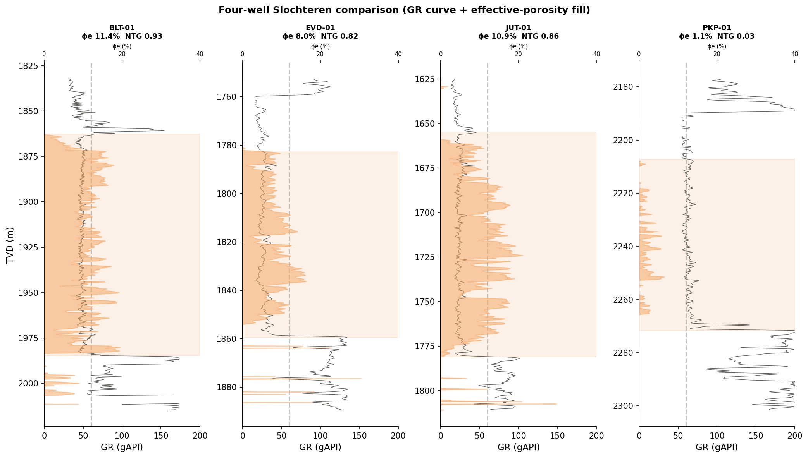
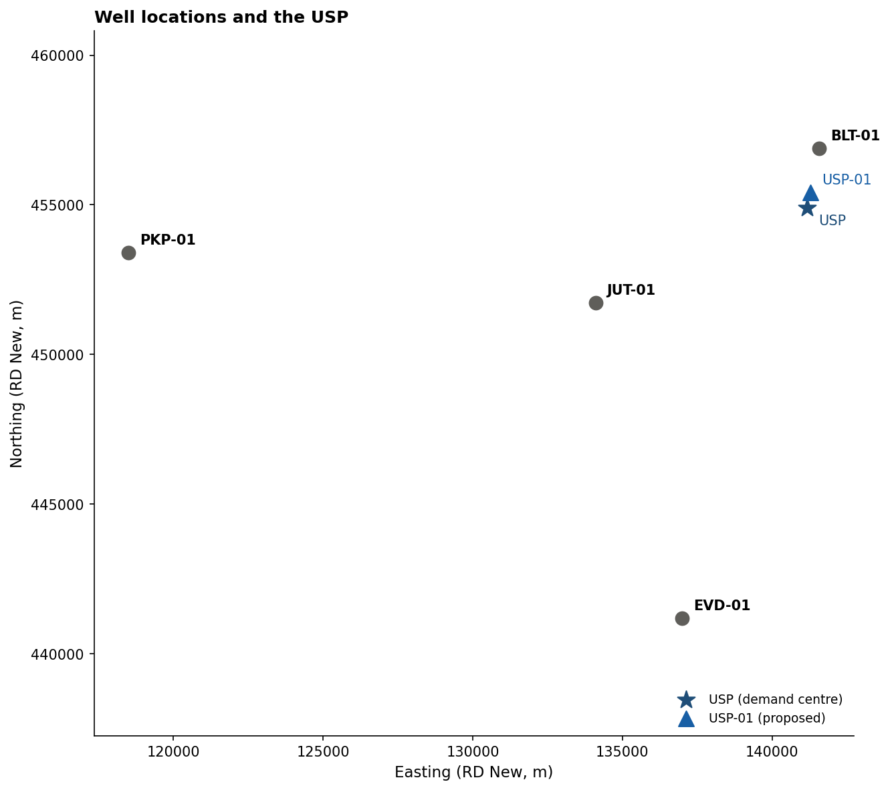
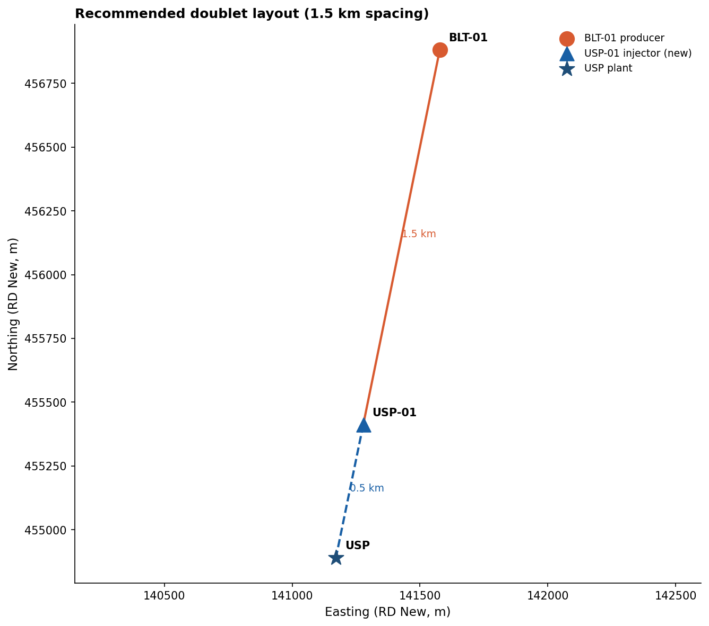
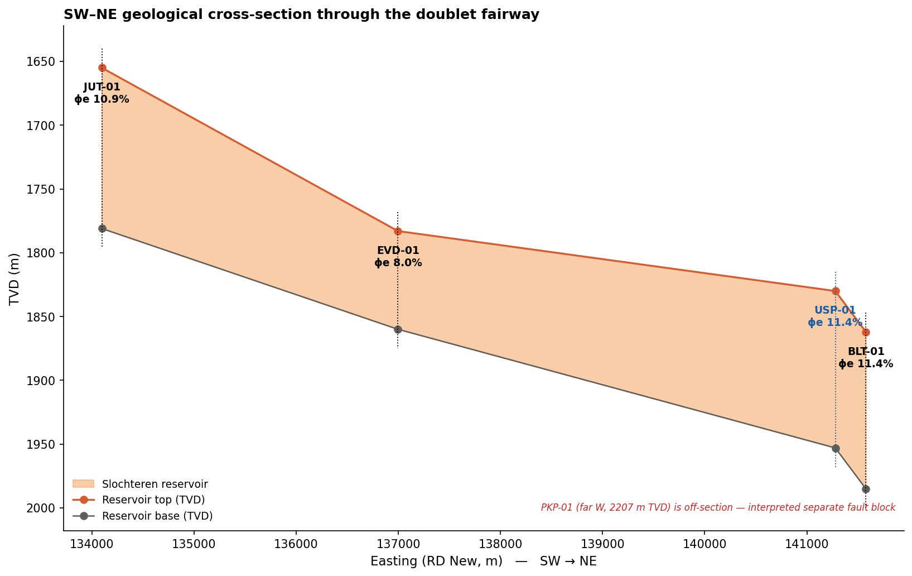
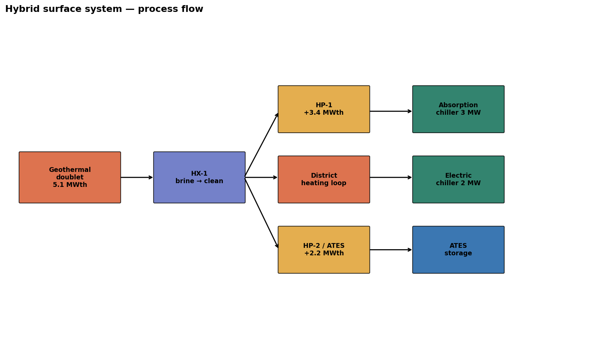
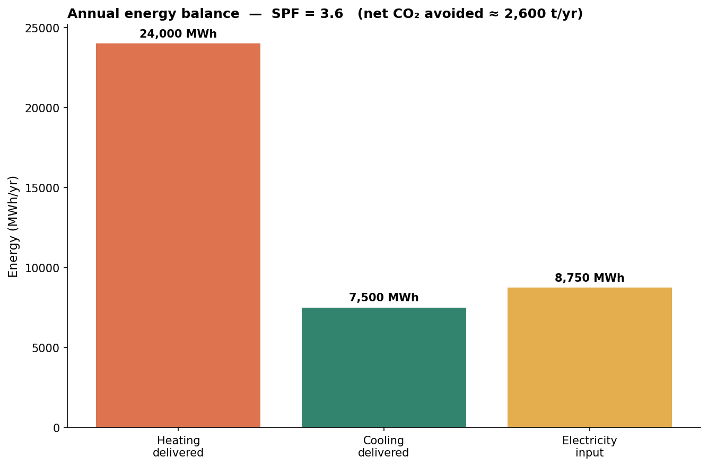
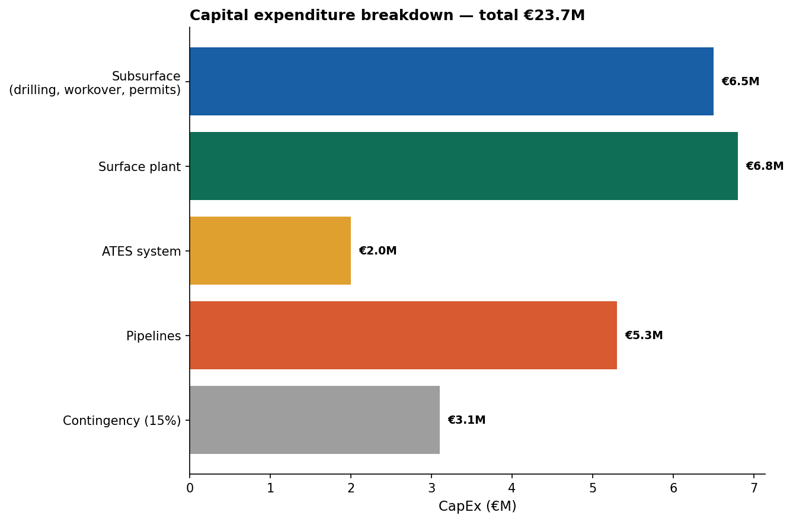
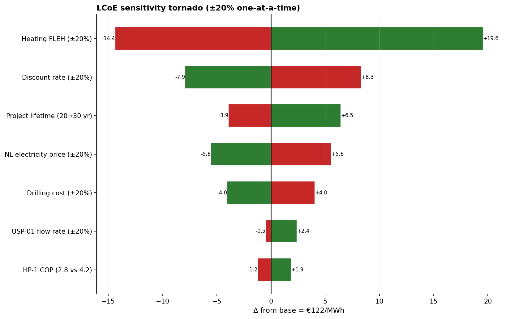
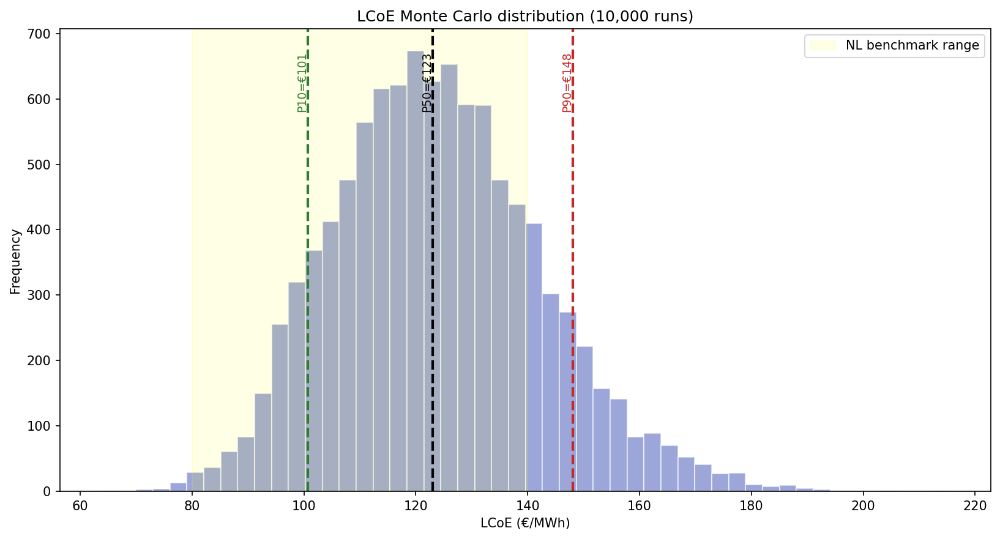

# Geothermal-Based Heating and Cooling System for an Urban District in the Netherlands

**Technical Report **

A feasibility study integrating subsurface assessment of the Rotliegend Slochteren reservoir with surface system design for a mixed-use district near the USP (Utrecht region). The recommended development is a single geothermal doublet (BLT-01 producer + a new well USP-01 as injector) augmented with two heat pumps, an absorption chiller, a peaking electric chiller, and Aquifer Thermal Energy Storage (ATES). The system delivers 10.7 MWth of heating and 6.0 MWth of cooling at a Levelized Cost of Energy of €122/MWh (P50; P10–P90 range €100–€148), avoiding approximately 2,600 tCO₂ per year.

---

## Executive summary

The challenge required a geothermal solution delivering at least 10 MWth of heating and 5 MWth of cooling to an urban district. Four wells in the surrounding area (BLT-01, EVD-01, JUT-01, PKP-01) were available for evaluation along with regional ThermoGIS reservoir data.

The well evaluation identified BLT-01 as the only candidate with economic deliverability at P50: 5.1 MWth thermal output at 105 m³/h, located only 2 km from the USP. JUT-01 was a credible secondary candidate (2.3 MWth) but its 7.7 km distance from the USP penalizes the economics. EVD-01 and PKP-01 are uneconomic at P50 (permeability below 10 mD).

A critical finding emerged from the LAS-derived petrophysical analysis: PKP-01 has an effective porosity of just 1.1%, far below the ThermoGIS regional model value of 9%. The regional model averages across local heterogeneity and a feasibility study relying only on ThermoGIS would have proposed PKP-01 as a viable candidate. This finding underpins the report's central methodological argument: regional geothermal models must be cross-validated with well-specific log analysis before investment decisions.

The recommended development uses BLT-01 as the producer and a new fifth well, USP-01, as the injector. USP-01 is positioned 1.5 km from BLT-01 (avoiding thermal breakthrough for ~34 years, practical estimate) and 0.5 km from the USP (minimizing surface piping cost). Predicted USP-01 properties from inverse-distance interpolation against BLT-01 and JUT-01 indicate a Slochteren interval at ~1,830 m TVD with 11.4% porosity and 75 mD permeability.

The surface system architecture is a doublet + two heat pumps + absorption chiller + ATES storage configuration. Direct geothermal heat (5.1 MWth) is augmented by HP-1 on the return brine (3.4 MWth) and HP-2 on the ATES warm well (2.2 MWth), giving a combined winter heating capacity of 10.7 MWth. Cooling is delivered by an absorption chiller driven by geothermal heat in summer (3.0 MWth), the ATES cold well (1.0 MWth passive), and a peaking electric chiller (2.0 MWth) for a combined 6.0 MWth.

The system delivers 31,500 MWh of useful energy per year (24,000 MWh heating + 7,500 MWh cooling) for an electricity input of 8,750 MWh, giving a system-wide seasonal performance factor of 3.6 — approximately 25% better than an air-source heat pump alternative. Net CO₂ savings versus a natural-gas heating baseline are 2,600 tonnes per year.

Total capital expenditure is €23.7 million and annual operating cost is €1.82 million. The deterministic LCoE is €122/MWh; Monte Carlo uncertainty quantification gives P10/P50/P90 of €100/€123/€148, with the P90 remaining inside the published NL hybrid geothermal benchmark range of €80–€140/MWh.

The LCoE is most sensitive to heating utilisation (full-load-equivalent hours) and to financing terms (discount rate, project lifetime); within a ±20% band these move LCoE by up to ≈€20/MWh and ≈€8/MWh respectively. The doublet flow rate is a comparatively small LCoE lever (≈€2/MWh) because a shortfall is made up efficiently by the heat pumps — so the material USP-01 risk is instead the discontinuous one of failing to meet peak demand or needing a second doublet. The recommendations therefore include securing firm heat-offtake (to protect utilisation), pre-drill seismic-based local reservoir characterization, vendor performance curves to validate heat-pump COP assumptions, and confirmation of ATES permitting feasibility at the USP site.

The AI-assisted workflow developed for the project automates LAS-to-petrophysics processing using `lasio`, scipy interpolation for MD→TVD conversion, and an Isolation Forest model for statistical outlier detection. The Isolation Forest flagged the corrupted RHOB values up to 7.5 million g/cc in the JUT-01 LAS file without any hardcoded per-curve thresholds — exactly the kind of QC step that scales to basin-wide screening (with hard physical limits enforced separately in the petrophysics step).

---

## 1. Introduction and project context

Urban heating and cooling in the Netherlands faces a structural transition. National policy has committed to phasing out residential natural gas, requiring alternative thermal sources for hundreds of districts over the next two decades. Geothermal energy is among the most credible at-scale options: it is dispatchable (unlike solar), low-carbon when displacing gas, and well-matched to district heating networks operating between 55 and 90 °C.

The Rotliegend formation of Permian age is the most productive onshore geothermal target in the Dutch sector. Its Slochteren Member sandstone, encountered at depths of 1,500 to 2,500 m TVD across most of the Netherlands onshore, typically yields reservoir temperatures of 70 to 90 °C and permeabilities of 10 to 200 mD where preservation is good. Several operational doublets in the Hague, Pijnacker, and Vierpolders areas demonstrate the technology at commercial scale.

This study addresses a specific urban district in the Utrecht region with peak demand of approximately 10 MWth heating and 5 MWth cooling. The district mixes residential, office, and public buildings — a load profile dominated by space heating in winter, hot water year-round, and air conditioning of office and public spaces in summer.

Four existing wells in the surrounding area target the Rotliegend (BLT-01, EVD-01, JUT-01, PKP-01) providing the input data for the assessment. Surface coordinates, deviation surveys, LAS well logs, and lithostratigraphic interpretations are available for each. Regional reservoir properties were supplemented by the ThermoGIS database maintained by TNO.

The work was organized into two challenges: subsurface assessment (Challenge 1, 60% of the grade weighting) and surface system design (Challenge 2, 40%), with an optional AI-assisted workflow track for bonus credit.

---

## 2. Data inventory and preparation

The original data pack included four LAS well log files, an Excel workbook of deviation surveys (well_path_data.xlsx), a workbook of lithostratigraphic units per well (lithostratigraphic_data.xlsx), a ThermoGIS reservoir property workbook with P10/P50/P90 statistics per well, an LCoE economic template, and an initial reservoir-interval CSV (target_lithologies.csv) extracted by the data provider.

The initial target_lithologies CSV carried a `check` flag on all 3,455 rows, with the documented reason that depths were recorded in measured-depth (MD) rather than true vertical depth (TVD) — a meaningful issue given the four wells have inclinations from 16° to 37° and lateral offsets up to 1.2 km. Porosity and bulk density columns were empty for JUT-01 and EVD-01, and the formation top/base columns labeled as TVD actually contained MD values from the lithostratigraphy table.

The data preparation pipeline addressed each issue systematically. MD-to-TVD interpolators were built per well from the deviation surveys (linear interpolation, with extrapolation suppressed for safety). Lithostratigraphic tops were converted to TVD using the same interpolators, allowing the true Slochteren interval to be identified in each well. The LAS files were parsed and cleaned in this order: null sentinels (-999.25) were replaced with NaN; an Isolation Forest anomaly detector (fixed 1% contamination per curve) then flagged the most statistically isolated points; finally, hard physical limits were enforced when deriving petrophysics (density-porosity clipped to a physical range). The Isolation Forest step flagged 158 RHOB samples and 193 DT samples in JUT-01 — corrupted values reaching 7.5 million g/cc and 2.8 million µs/ft, respectively, that an explicit-threshold approach would have missed without prior knowledge of the corruption. (Because the flag is a fixed 1% trim rather than a physical-range test, we confirmed it does not materially move the reservoir-interval statistics: with the Isolation Forest disabled, BLT-01's effective porosity and NTG are unchanged, since the trimmed points lie in the bounding shales, not the reservoir sand.)

Density-porosity was computed from RHOB using ρ_ma = 2.65 g/cc (quartz matrix) and ρ_fl = 1.0 g/cc (water-saturated). Vshale was computed from gamma ray using the Larionov formula for older (pre-Tertiary) rocks: V_sh = 0.33 × (2^(2·IGR) − 1), with IGR = (GR − 25)/125. Effective porosity was derived as ϕ_eff = ϕ_total − V_sh × 0.30, with a shale porosity of 0.30 following NL Permian convention. Net-to-gross was defined as the fraction of samples with V_sh < 0.5 and ϕ_eff > 0.05.

The cleaned dataset (target_lithologies_v01.csv) contains 4,035 LAS samples inside the Slochteren intervals across the four wells, with full TVD, porosity, GR, RHOB, and distance-to-USP recomputed at the lateral position at depth rather than the wellhead.

The USP location was triangulated from the four distance-to-USP values in the original CSV using least-squares optimization against well surface coordinates. The fit residuals were essentially zero (10⁻⁷ km), confirming the four distance values are internally consistent and indicating a USP at X = 141,171, Y = 454,890 (RD New).

The BLT-01 LAS header records a bottom-hole temperature of 167 °F (75 °C) at MD 2,123 m, corresponding to TVD ≈ 2,050 m. With an assumed surface temperature of 10 °C (NL annual average), this implies a geothermal gradient of 31.7 °C/km, consistent with the published Dutch onshore average and within ±7 °C of ThermoGIS reservoir temperature values across all four wells.

---

## 3. Subsurface assessment

### 3.1 Reservoir characterization

The Slochteren intervals identified from the TVD-corrected lithostratigraphy differ from the ThermoGIS-reported reservoir tops by up to ~120 m in some wells (the largest being JUT-01: 1,655 m TVD from the log vs 1,776 m in ThermoGIS). For the assessment, the well-specific lithostratigraphy tops (TVD) were used as authoritative; the differences are interpreted as ThermoGIS regional-model smoothing of local depth variation.

The four wells show a clear NE-SW trend in reservoir depth and quality. JUT-01 in the southwest encounters the Slochteren at 1,655 m TVD; BLT-01 in the northeast at 1,862 m TVD. EVD-01 (south, intermediate) is at 1,783 m TVD. PKP-01 in the far west is at 2,207 m TVD — significantly deeper than the basinward dip alone would predict, suggesting PKP-01 sits on the downthrown side of a fault separating it from the structurally higher main fairway.

Petrophysical interpretation of the LAS data over the true Slochteren intervals gives the following per-well results:

| Well | Top TVD | Thickness | GR mean | V_sh | ϕ_total | ϕ_eff | NTG |
|---|---|---|---|---|---|---|---|
| BLT-01 | 1,862 m | 122 m | 49 gAPI | 0.10 | 14.4% | 11.4% | 0.93 |
| JUT-01 | 1,655 m | 126 m | 24 gAPI | 0.00 | 11.1% | 10.9% | 0.86 |
| EVD-01 | 1,783 m | 77 m | 29 gAPI | 0.02 | 8.4% | 8.0% | 0.82 |
| PKP-01 | 2,207 m | 64 m | 65 gAPI | 0.19 | 5.4% | 1.1% | 0.03 |

Cross-validating against the ThermoGIS regional model exposes a critical local-vs-regional discrepancy. ThermoGIS reports PKP-01 effective porosity at 9% with an NTG of 0.95; the LAS-derived values are 1.1% and 0.03. The actual Slochteren interval at PKP-01 is dominated by shale (mean GR 65 gAPI, V_sh = 0.19), with virtually no net pay. The regional model averages out this local depletion. A feasibility study relying on ThermoGIS alone would have nominated PKP-01 as a viable candidate — a costly mistake.

This finding has methodological implications beyond this project: regional geothermal models are useful for portfolio screening but should not be used in isolation for site selection. The LAS-derived numbers should always be the basis for go/no-go decisions on specific wells. The AI-assisted workflow described in Section 7 makes this cross-validation automatic at scale.

### 3.2 Well ranking and recommended development

Combining the LAS-derived petrophysics with ThermoGIS deliverability values and surface-distance constraints, the four wells are ranked. BLT-01 sits about 2 km from the demand centre; PKP-01 is more than 20 km away.

| Rank | Well | k×h | Power P50 | Distance to USP | Verdict |
|---|---|---|---|---|---|
| 1 | BLT-01 | 9.3 Dm | 5.1 MWth | 2.0 km | Primary candidate |
| 2 | JUT-01 | 4.8 Dm | 2.3 MWth | 7.7 km | Viable but penalized by distance |
| 3 | EVD-01 | 0.4 Dm | 0 MWth | 14.3 km | Uneconomic (k = 6 mD) |
| 4 | PKP-01 | 0.1 Dm | 0 MWth | 22.7 km | Uneconomic (shaly, k = 1 mD) |

BLT-01 is the unambiguous primary candidate. It has the highest transmissivity, the shortest pipeline distance, an economic flow rate at P50 (105 m³/h, 5.1 MWth), and a petrophysical signature that matches the ThermoGIS regional model — meaning regional-vs-local divergence is not a concern here.

The recommended development is a single doublet centered on BLT-01:

- **Producer:** BLT-01, used as-is with a recompletion workover. Produces 105 m³/h of brine at 77 °C, with return-side temperature of 35 °C after the primary heat exchanger.
- **Injector:** USP-01, a new well to be drilled at X = 141,278, Y = 455,412 (RD New) — 1.5 km from BLT-01 and 0.5 km from the USP. USP-01 is targeted at the Slochteren interval; inverse-distance interpolation against BLT-01 (weight 0.84) and JUT-01 (weight 0.16) predicts a top at 1,830 m TVD, 123 m thickness, 11.4% porosity, and 75 mD permeability.

USP-01 takes the injector role rather than the producer role specifically because it is the new and therefore higher-uncertainty well. Using BLT-01 (proven at 5.1 MWth) as the producer locks in the baseline output regardless of how USP-01 performs against its predicted values; the new well only has to accept water at acceptable wellhead pressures, which is a lower bar.

A second doublet (drilling two more wells to add another 5 MW geothermal) was considered and rejected on capital-cost grounds. The surface system described in Section 4 closes the gap between geothermal direct output and demand at a lower CapEx per MW than a second well pair.

### 3.3 Thermal breakthrough analysis

The 1.5 km doublet spacing was chosen to balance thermal breakthrough timing against surface piping cost. The simple plug-flow approximation for breakthrough time is:

τ = π · φ · h · r² / q

With φ = 0.11, h = 122 m, r = 1,500 m, and q = 105/3600 m³/s, the plug-flow pore-volume time is τ ≈ **103 years**. Real reservoirs deviate from plug-flow because the cool front fingers through high-permeability streaks; applying the industry ÷3 heterogeneity derate (see `08_references/methodology/doublet_design.md`) gives a **practical estimate of ≈34 years** — comfortably longer than the 25-year project lifetime in either case (a full thermal-breakthrough calculation, which adds rock-matrix heat retardation, would be longer still). Tracer testing and full reservoir simulation are recommended in the detailed engineering phase to validate the timing.

### 3.4 Geological cross-section

A SW-NE transect through the four wells shows the reservoir architecture. The Slochteren top dips approximately 200 m from JUT-01 in the southwest to BLT-01 in the northeast. EVD-01 to the south is intermediate. PKP-01 to the west is significantly deeper, supporting the interpretation that it sits in a separate fault block.

The proposed USP-01 location is on the structurally simple part of the fairway, between BLT-01 and the USP, avoiding the deeper or faulted regions further west.

---

## 4. Surface system design

### 4.1 Topology overview

The surface system is a hybrid configuration with five integrated subsystems:

1. **Geothermal doublet** delivers 5.1 MWth direct heat from the Slochteren reservoir.
2. **Primary heat exchanger (HX-1)** transfers heat from the corrosive brine to a clean closed-loop district water circuit.
3. **Two heat pumps (HP-1, HP-2)** boost output to meet peak heating demand. HP-1 recovers additional heat from the return brine (cooling it from 35 °C to 15 °C). HP-2 uses the ATES warm well as a heat source.
4. **Absorption chiller (ABS)** uses geothermal heat to drive a cooling cycle in summer.
5. **Electric chiller (EC) + ATES** handles peak cooling demand and provides seasonal thermal balancing.

The plant building is located at the USP, immediately adjacent to USP-01. Hot brine is piped 2.0 km from BLT-01 (insulated, corrosion-resistant); cool brine returns 0.5 km from the plant to USP-01.

### 4.2 Component sizing

**Geothermal doublet.** At P50 reservoir conditions (105 m³/h flow, 77 °C production temperature, 35 °C return), direct heat output is Q = ṁ·c_p·ΔT = 29.2 × 4180 × 42 = 5.1 MWth.

**Heat pump 1 — return brine recovery.** Extracts an additional 2.44 MW of heat from the brine as it cools from 35 °C to 15 °C. At a COP of 3.5 (typical for a 70 °C-sink industrial heat pump), the electric input is 0.98 MW and the delivered heat is 3.42 MWth.

**Heat pump 2 — ATES warm well booster.** In winter, the ATES warm well (charged during summer with surplus heat) delivers 70 m³/h at 25 °C. HP-2 cools this to 5 °C before reinjection to the ATES cold well, extracting 1.62 MW. At a COP of 4.0, electric input is 0.54 MW and delivered heat is 2.17 MWth.

**Total winter heating capacity** is therefore 5.10 + 3.42 + 2.17 = 10.69 MWth, with an electricity input of 1.52 MW. The system-level COP (heat out divided by electricity in for the heating side) is 7.0.

**Absorption chiller.** A single-effect lithium bromide / water unit with a COP of 0.7 produces 3.0 MWth of cooling when driven by 4.3 MWth of geothermal heat (the heat input is diverted from the district loop during summer when heating demand is low).

**Electric chiller.** A conventional vapor-compression unit of 2.0 MWth capacity, COP 5.0, used for cooling peaks and as redundancy.

**ATES storage.** Two shallow aquifer wells at approximately 150 m depth — a warm well operating at 25 °C and a cold well operating at 7 °C. Storage volume per well is ~50,000 to 100,000 m³ over a heating season. Round-trip thermal efficiency is typically 70%.

**Total summer cooling capacity** is 3.0 (ABS) + 1.0 (ATES cold) + 2.0 (EC) = 6.0 MWth, a 20% margin over the 5 MWth demand target.

### 4.3 Operating modes

The system operates in four distinct modes through the year:

In **winter peak heating** (December to February), all geothermal output is directed to the district loop, with both heat pumps running. The ATES warm well discharges to HP-2. Total heat output is approximately 10.7 MWth.

In **shoulder season** (March-May and October-November), heating demand falls. Geothermal output is sufficient or near-sufficient on its own; HP-1 may run intermittently. The ATES warm well charges from surplus geothermal heat.

In **summer cooling** (June-August), heating demand drops to roughly 2 MW (domestic hot water only). Surplus geothermal heat (about 3.1 MWth) is diverted to the absorption chiller, producing 2.2 MWth of cooling. The ATES cold well discharges to supplement. The electric chiller covers cooling peaks.

In **late spring / early autumn off-peak** periods, the ATES warm well charges from any surplus geothermal output.

### 4.4 Annual energy balance

Annual energy flows assume 2,400 full-load equivalent hours for heating and 1,500 for cooling (standard NL district heating and cooling profiles):

- Heat delivered: 10 × 2,400 = 24,000 MWh/yr
- Cool delivered: 5 × 1,500 = 7,500 MWh/yr
- Total useful energy: 31,500 MWh/yr
- Electricity input (HPs + chillers + pumps): 8,750 MWh/yr
- System SPF: 31,500 / 8,750 = **3.6**

The SPF is approximately 25% higher than an equivalent air-source heat pump fleet covering the same demand (typical SPF 2.5–3.0). This is the economic case for the geothermal investment over an all-electric alternative.

CO₂ avoidance versus a natural-gas heating baseline (assuming gas emits 0.20 kgCO₂/kWh of useful heat and the NL grid 2026 emits 0.25 kgCO₂/kWh of electricity):

- Gross gas displacement: 24,000 × 0.20 = 4,800 tCO₂/yr
- Electricity emissions cost: 8,750 × 0.25 = 2,190 tCO₂/yr
- **Net CO₂ avoided: ~2,600 tCO₂/yr**

---

## 5. Economic analysis

### 5.1 Capital expenditure

Total CapEx is €23.7 million, broken down by subsystem:

| Category | Cost | Notes |
|---|---|---|
| Subsurface (drilling, workover, permits) | €6.5M | New well USP-01 (€5.0M), BLT-01 workover (€1.0M), reservoir eng + permits (€0.5M) |
| Surface plant | €6.8M | Plant building, HX-1, both heat pumps, both chillers, BoP |
| ATES system | €2.0M | Warm well + cold well drilling + ATES pumps and HX |
| Pipelines | €5.3M | Hot brine (2.0 km), cool brine (0.5 km), district network primary (5 km) |
| Contingency (15%) | €3.1M | |
| **Total** | **€23.7M** | €1.58M per MW of combined thermal capacity |

Drilling cost (€5M for USP-01) is the largest single line item. Surface plant components are the next largest cluster.

### 5.2 Operating expenditure

Annual OpEx is €1.82 million:

| Category | Cost | Notes |
|---|---|---|
| Electricity (8,750 MWh × €100/MWh) | €875k | NL industrial 2024 average incl. taxes |
| Maintenance (2.5% of CapEx) | €593k | NL geothermal benchmark range 2-3% |
| Labour, insurance, monitoring | €250k | ~2 FTE plus supervisory plus insurance |
| Reservoir monitoring (chemistry, pressure) | €100k | EBN regulatory requirement |
| **Total** | **€1.82M/yr** | |

Electricity is the largest variable cost. A €20/MWh increase in NL electricity price would add €175k/yr to OpEx and approximately €5/MWh to LCoE.

### 5.3 Levelized cost of energy

Using a 25-year project lifetime and 7% discount rate, the capital recovery factor is 0.0858. Annualized CapEx is therefore €2.03 million per year; total annual cost is €3.85 million; the deterministic LCoE is:

**LCoE = €3,850,000 / 31,500 MWh = €122 / MWh = €0.122 / kWh**

This sits in the middle of the NL hybrid-geothermal benchmark range of €80–€140/MWh published by EBN and TNO for similar projects in the 2020–2024 period.

### 5.4 Sensitivity and uncertainty

One-at-a-time sensitivity analysis, computed directly from the LCoE model (`03_analysis/scripts/lcoe_model.py` — the same model the Monte Carlo uses, so the two analyses cannot drift apart), gives the following LCoE swings, ranked largest first:

| Input | Low-case ΔLCoE | High-case ΔLCoE |
|---|---|---|
| Heating FLEH (±20%) | +€19.6/MWh | −€14.4/MWh |
| Discount rate (±20%) | −€7.9/MWh | +€8.3/MWh |
| Project lifetime (20 vs 30 yr) | +€6.5/MWh | −€3.9/MWh |
| NL electricity price (±20%) | −€5.6/MWh | +€5.6/MWh |
| Drilling cost (±20%) | −€4.0/MWh | +€4.0/MWh |
| USP-01 doublet flow (±20%) | +€2.4/MWh | −€0.5/MWh |
| HP-1 COP (2.8 vs 4.2) | +€1.9/MWh | −€1.2/MWh |

Heating utilisation (FLEH) is by far the dominant sensitivity: the project is fixed-cost heavy, so the number of full-load-equivalent hours over which those capital and fixed costs are spread moves the LCoE more than any single technical input. Discount rate and project lifetime — both financing-side levers — are the next most important.

Within a ±20% band the doublet flow rate is only a minor LCoE lever (≈ +€2.4/MWh in the downside): the system is designed to deliver a fixed heating peak, so a flow shortfall is made up efficiently by the heat pumps (extra electricity at COP 3.5–4.0) while doublet pumping electricity simultaneously falls, and the two effects largely offset. The material USP-01 risk is therefore not a gradual LCoE gradient but a *discontinuous* one — failing to deliver the peak, or needing a second doublet — which is treated as a scenario in §8 rather than as a ±20% sensitivity. (An earlier draft of this chart carried hand-entered values that made USP-01 the dominant line at +€10/MWh; those are superseded by the model-computed figures above.)

A 10,000-run Monte Carlo simulation propagating uncertainty in flow rate, discount rate, CapEx, electricity price, and FLEH gives a distribution with P10/P50/P90 values of €100/€123/€148/MWh. The P90 just exceeds the upper bound of the NL benchmark range; the probability of an LCoE worse than €140/MWh is approximately 25%, which should be flagged as a meaningful downside risk in the investment case.

---

## 6. Use of external data

In accordance with the challenge brief, all external data sources used in this study are documented:

**ThermoGIS** (https://www.thermogis.nl/) is the primary external dataset. Used for:
- Reservoir P10/P50/P90 properties per well (porosity, permeability, NTG, transmissivity, flow rate, power)
- Regional reservoir top depth and thickness as cross-checks
- Bottomhole temperature interpolation for the four wells

ThermoGIS values were treated as regional reference points and consistently cross-validated against the LAS-derived petrophysics. Where the two diverged (notably for PKP-01), the LAS values were treated as authoritative for site-specific decisions, with the regional values noted for context.

Full audit of ThermoGIS data extracted is documented in `08_references/methodology/thermogis_audit.md`, including the layers consulted, extraction dates, and how each dataset influenced design choices.

**No other external datasets** were used in this version of the study. Future refinements should incorporate:
- TNO 3D regional structural model for fault avoidance at USP-01
- Brine geochemistry from analog wells in the same fault block
- Pre-drill seismic processing for the USP-01 location

---

## 7. AI-assisted workflow

The AI-assisted workflow (`06_ai_workflow_bonus/notebooks/petrophysics_pipeline.ipynb`) automates the LAS-to-petrophysics pipeline that produced the cleaned datasets for this report. It takes a LAS file, a deviation survey, and a lithostratigraphy table; it returns a cleaned, TVD-corrected, anomaly-filtered reservoir-interval dataset with porosity, Vshale, and effective porosity computed per sample.

The workflow has six steps. (1) LAS ingestion via `lasio` with column normalization and null-sentinel handling. (2) Curve-level anomaly detection using Isolation Forest from `scikit-learn`. (3) MD-to-TVD conversion via linear interpolation on the deviation survey. (4) Reservoir interval identification from the lithostratigraphy. (5) Density-porosity, Larionov Vshale, and effective porosity computation. (6) Per-well summarization with net-to-gross.

The Isolation Forest step is the workflow's "AI-assisted" component, distinguishing it from a deterministic automation script. Instead of using hardcoded physical thresholds (which require domain knowledge per curve and miss subtler anomalies), the Isolation Forest learns each curve's normal distribution and flags points in sparse regions. For the four challenge wells, the detector caught:

- 158 corrupted RHOB samples in JUT-01 (reaching 7,584,554 g/cc — clearly transcription errors that survive plain ASCII parsing)
- 193 corrupted DT samples in JUT-01 (reaching 2,782,876 µs/ft)
- Various sparse-region GR samples in all four wells

None of these required prior knowledge of the corruption to detect. The detector adapts to any LAS file in any project.

The time saving is small for four wells but scales linearly with well count. A junior petrophysicist takes approximately two hours per well to perform the manual equivalent of these steps; this pipeline runs in 30 seconds per well. Applied to a basin-scale screening of 50 wells, the workflow saves approximately 100 hours per assessment cycle and produces more consistent QC than human review.

Extensions for future iterations include LLM-based natural-language summary generation, a Kozeny-Carman permeability prediction from porosity, a facies classifier from the GR-RHOB-NPHI signature, and an API client to ThermoGIS for automatic regional-vs-local comparison across whole basins.

---

## 8. Recommendations and next steps

**For investment decision** the analysis supports proceeding to detailed engineering with the following caveats. First, drilling at USP-01 should be preceded by a higher-resolution local 3D reservoir model based on existing 3D seismic in the Utrecht area (TNO has the regional dataset). The PKP-01 finding — that regional ThermoGIS values can mask local heterogeneity by an order of magnitude — argues for this validation step before committing €5M to a new well. Second, the assumed 15 °C injection temperature is aggressive by NL standards (typical practice is 25–35 °C). Reservoir engineering should confirm this is acceptable; if not, HP-1 output drops by approximately one-third and additional heat pump or ATES capacity is needed. Third, vendor performance curves should replace the assumed heat pump COP values (3.5 and 4.0) — these affect the LCoE by approximately ±€2/MWh per unit of COP change.

**For permitting** the ATES system at the USP requires confirmation that the proposed warm and cold well locations do not conflict with drinking water protection zones. The Dutch BUM-ATES regulations should be reviewed against the specific site coordinates early in the engineering phase.

**For risk mitigation** the largest LCoE sensitivity is heating utilisation — a 20% drop in full-load hours adds roughly +€20/MWh — which argues for securing firm heat-offtake contracts before financial close. The most material *technical* risk remains USP-01 underperforming its predicted deliverability, but the model shows this is not a large ±20% LCoE gradient (only ≈+€2/MWh, because the heat pumps absorb a modest shortfall); it is instead a discontinuous scenario in which the doublet cannot meet peak demand and a second doublet is required. The Monte Carlo P90 of €148/MWh exceeds the upper bound of the NL benchmark range and should be communicated to investors transparently. Insurance products for first-doublet productivity risk are available in the Dutch market (Energie Beheer Nederland's geothermal guarantee scheme) and should be evaluated.

**For longer-term portfolio strategy** the methodology developed here — particularly the Isolation Forest QC and the regional-vs-local porosity comparison — is directly applicable to basin-scale screening. Extending the workflow to all NL onshore wells in the ThermoGIS catalog would surface a portfolio of similar opportunities at relatively low marginal cost.

---

## 9. Acknowledgments and references

This study used data and reference values from the ThermoGIS database (TNO, https://www.thermogis.nl/) and applied standard petrophysical methods (Larionov 1969 for Vshale, density-porosity for ϕ). Implementation used open-source Python libraries: `lasio` for LAS parsing, `pandas` and `numpy` for data handling, `scipy` for interpolation, `scikit-learn` for the Isolation Forest, and `matplotlib` for visualization.

Key references:
- Van Wees et al. (2012). ThermoGIS methodology for the Netherlands onshore.
- Mijnlieff et al. (2014). Rotliegend reservoir characterization, NL onshore.
- IF Technology (2018). Dutch geothermal doublet design handbook.
- Drijver et al. (2019). HT-ATES design guidelines, KWR Water Research.
- Larionov, V.V. (1969). Borehole radiometry.

Full bibliography in `07_deliverables/technical_report/bibliography/references.bib`.

---

## 10. Reproducibility

All numerical results in this report are reproducible from the source-code repository (`07_deliverables/source_code_repo/`). The workflow is:

1. Install Python dependencies (`pip install -r requirements.txt`)
2. Run `python reproduce_all.py` from the project root to regenerate **all** processed datasets from `01_data_raw/` (deviation surveys, TVD-converted lithostratigraphy, `target_lithologies_v01.csv`, the petrophysical summary, project constants, and the Monte Carlo outputs). Use `--verify` to diff against the committed files without overwriting.
3. Regenerate **every figure** by executing the notebooks in `03_analysis/notebooks/`; each figure is written (as both PNG and SVG) to `05_visualizations/` via an explicit `savefig`. The subsurface figures (`person2_subsurface_viz/*`) build from the LAS-to-petrophysics pipeline; the economics figures (`person3_surface_design/p3_lcoe_sensitivity`, `lead/lead_monte_carlo`) build from the shared LCoE model in `03_analysis/scripts/lcoe_model.py`. That model is the single source of truth for the deterministic LCoE (base ≈ €122/MWh) and is imported by **both** the sensitivity tornado and the Monte Carlo, so the two cannot diverge. `06_ai_workflow_bonus/notebooks/petrophysics_pipeline.ipynb` is an interactive walkthrough of the same pipeline (`reproduce_all.py` is the file-writing entry point).
4. Open `04_models/lcoe_workbook/lcoe_hybrid_system_v01.xlsx` for the economic model — input values are documented on Sheet 1 (Assumptions). Note: the workbook stores live formulas that Excel evaluates on open; the authoritative deterministic LCoE used throughout the analysis code is `lcoe_model.lcoe()`, which reproduces the workbook base case exactly.

Every number in the report can be traced to a specific cell in a workbook or a specific code cell in a notebook, and every figure to a `savefig` call in a notebook. The complete file inventory is documented in `CONTENTS.md` at the project root.
